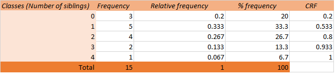
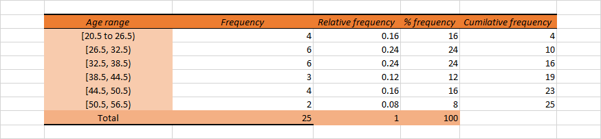
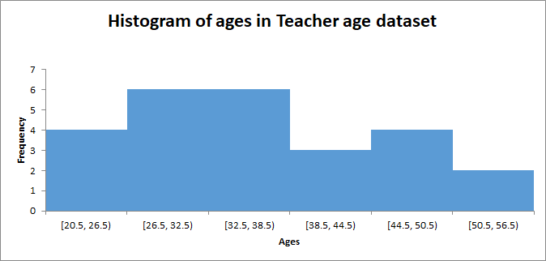
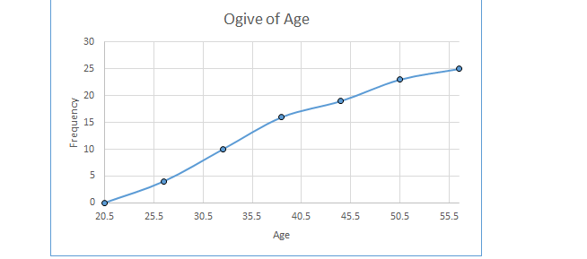

```{r setup, include=FALSE}
knitr::opts_chunk$set(echo = TRUE)
```

For questions 1-5, indicate the level of measurement being used in the given scenario: Nominal, ordinal, interval, or ratio.

1.  A local animal shelter keeps track of the breeds of dogs that come in.

> **Answer:** Nominal.

2.  A local animal shelter keeps track of the weight of dogs that come in.

> **Answer:** Ratio.

3.  The number of miles joggers run per week.

> **Answer:** Ratio.

4.  The starting salaries of graduates of MBA programs.

> **Answer:** Ratio.

5.  Before leaving a restaurant, customers are provided a feedback form. For each question, determine the level of measurement:

    a.  What is the approximate distance between this restaurant (in miles) & your residence?

    > **Answer:** Ratio.

    b.  Have you ever eaten at this restaurant before?

    > **Answer:** Nominal.

    c.  On how many occasions have you eaten at this restaurant before?

    > **Answer:** Ratio.

    d.  Which of the following attributes of this restaurant do you find most attractive: service, prices, quality of the food, or the menu?

    > **Answer:** Nominal.

    e.  What is your overall rating of this restaurant: excellent, good, fair or poor?

    > **Answer:** Ordinal.

 

6.  Fifteen students answered the question of how many siblings they have. The answers were:

$$1, 1, 2, 0, 3, 2, 1, 4, 2, 3, 1, 0, 0, 1, 2.$$

> Construct a simple frequency distribution which includes frequencies, relative frequencies, percent frequencies and cumulative relative frequencies.

> **Answer:**

> This data has a *discrete* structure. Therefore, our classes should be 0, 1, 2, 3, 4. Frequency column is filled by frequency of each class. Relative frequency is filled by dividing the frequency of each class by the total number of data (in this case 15). Percent frequencies are constructed by multiplying each relative frequency by 100. For cumulative relative frequencies, first cell would be the relative frequency of that cell. The rest would be filled as relative frequency of that cell+ cumulative relative frequency of the previous cell. Last cell must be 1.

\vspace{2cm}

{width="672"}

\newpage

7.  The ages (in years) of a sample of 25 teachers are as follows:

```{=tex}
\begin{center}
\begin{tabular}{|l|l|l|l|l|}
\hline 47 & 21 & 37 & 53 & 28 \\
\hline 40 & 30 & 32 & 34 & 26 \\
\hline 34 & 24 & 24 & 35 & 45 \\
\hline 38 & 35 & 28 & 43 & 45 \\
\hline 30 & 45 & 31 & 41 & 56 \\
\hline
\end{tabular}
\end{center}
```
a.  How many classes does Sturges' formula suggest?

> **Answer:** Sturges' formula is : $\text{Number of classes}= 1+3.3 \log{(n)}$. $n=25$ in this case. Therefore:

$$
\text{Number of classes}= 1+3.3 \log_{10}{(25)}=5.613202 \approx 6.
$$

b.  Develop a grouped frequency distribution, showing the frequencies, relative frequencies, percent frequencies and cumulative frequencies.

c.  Draw a histogram and an ogive based on the frequency distribution.

> **Answer (both b and c):**

> We know number of classes should be 6 based on a. To find the width of each class, we want to use the following formula:

$$
\frac{\text { Largest Observation }-\text { Smallest Observation }}{\text { Number of Classes }}
$$

> Based on the above formula, the width of each class should be $\frac{56-21}{6}=5.83333\approx 6$. Now we can construct the grouped frequency distribution as well as histogram and an ogive.






