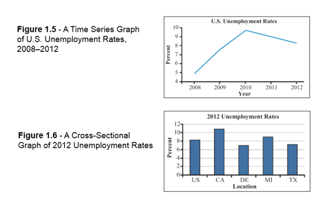
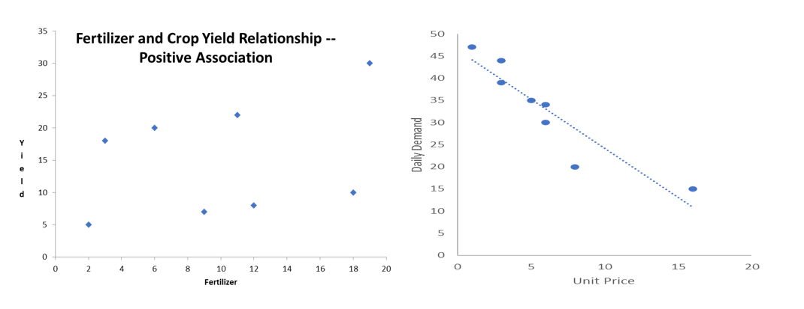

```{r setup, include=FALSE}
knitr::opts_chunk$set(echo = TRUE)
```

## Where do I get slides/worksheets/solution?

{width="164"}

Or go to fredazizi.github.io/Teaching

## Quick review (1)

-   How to choose Number of classes? **Sturges's formula**. (Round up to an integer if necessary)

$$
\text{Number of classes}= 1+3.3 \log_{10}{n}
$$

-   Class width $=\frac{\text { Largest Observation }-\text { Smallest Observation }}{\text { Number of Classes }}$.

-   Select a lower limit for the first class. If the measurements have $k$ places of decimals, you should deduct a number that has $k+1$ decimals, from the **minimum measurement**.

## Quick review (2)

Graphical representations:

-   Histogram
    -   Show the frequency distribution for quantitative data over a set of class intervals (Similar to bar chart but works over class intervals).

    -   Constructed by rectangles whose bases are the intervals and whose heights are the frequencies ( or relative frequencies or percent frequencies).

    -   No gaps between bars.

    -   Show shape of distribution.

\vspace{2cm}

## Quick review (3)

Graphical representations for Cumulative Frequency:

-   Ogive
    -   We plot the class end points on the horizontal axis and the cumulative frequencies on the vertical axis. Start from 0 go up to the amount of cumulative frequency toward the end of class.
    -   End point is always 1, 100 or total frequency depending on cumulative frequency we are using.

\vspace{2cm}

## Quick review (4)

-   Time series data are values that correspond to specific measurements taken over a range of time periods.

-   Cross-section data are values collected from a number of subjects during a single time period

{width="360"}

## Quick review (5)

-   Scatter plot: A graph that displays pairs of values as points on a two-dimensional grid.

-   The independent/explanatory variable is placed on the horizontal axis, or x-axis. The dependent/response variable is placed on the vertical axis, or y-axis.




## Quick review (6)

 measure of central tendency: 
 
* Compute the (Arithmetic) Mean to 
   + Describe the central location of a single set of interval and ratio data

* Compute the Median to
   + Describe the central location of a single set of interval and ratio or ordinal data

* Compute the Mode to 
   + Describe a single set of nominal, ordinal, interval or ratio data
