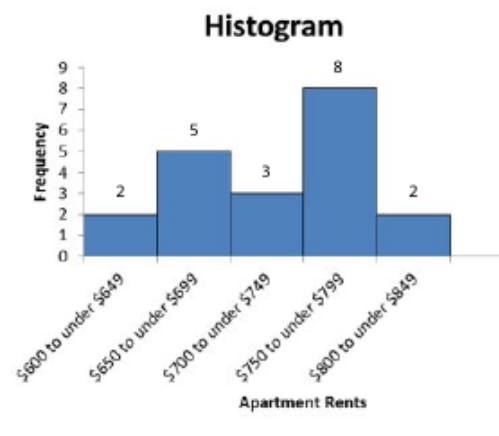
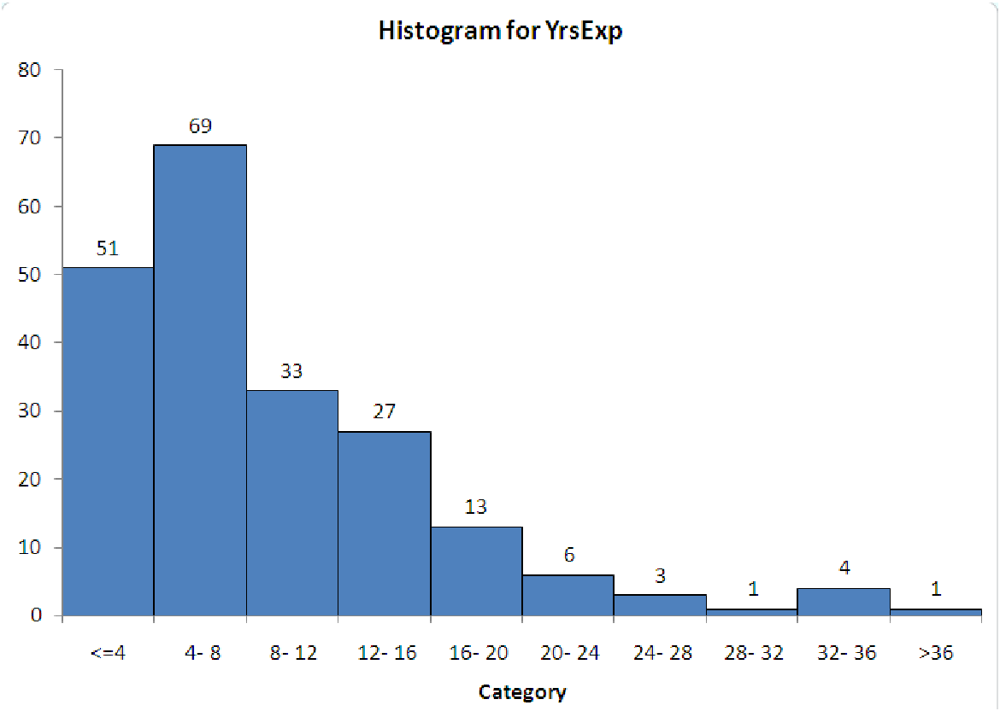
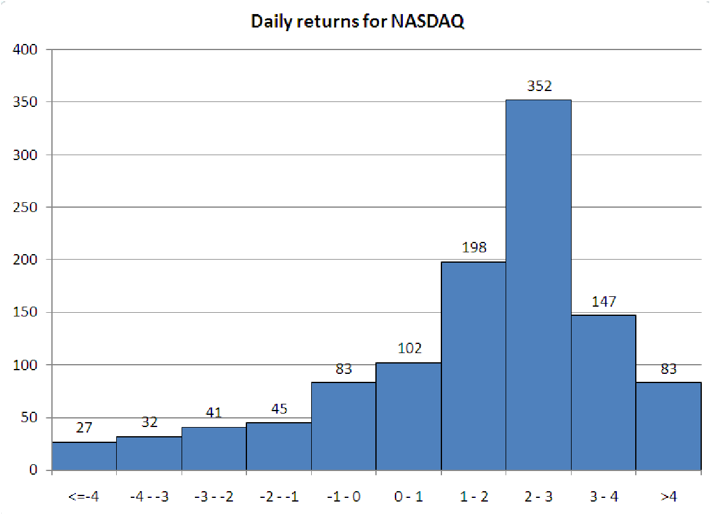

```{r setup, include=FALSE}
knitr::opts_chunk$set(echo = TRUE)
```

1. The ages (in years) of a sample of 25 teachers are as follows:

\begin{center}
\begin{tabular}{|l|l|l|l|l|}
\hline 47 & 21 & 37 & 53 & 28 \\
\hline 40 & 30 & 32 & 34 & 26 \\
\hline 34 & 24 & 24 & 35 & 45 \\
\hline 38 & 35 & 28 & 43 & 45 \\
\hline 30 & 45 & 31 & 41 & 56 \\
\hline
\end{tabular}
\end{center}

> a. How many classes does Sturges' formula suggest?

> b. Develop a grouped frequency distribution, showing the frequencies, relative frequencies, percent frequencies and cumulative frequencies.

> c. Draw a histogram and an ogive based on the frequency distribution.


\newpage

2.  The following histogram shows the distribution of the monthly rental for a random sample of one-bedroom apartments in York, Pennsylvania.

    {width="334"}

<!-- -->

> a.  What is the total number of apartments in this sample, and what is the percentage of monthly rents that are \$750 and above? If we rank the observations from low to high, what can you say about the range of 8th ranked observation?

> b.  Identify the shape of below histograms \footnote{Graphs are from \url{http://citadel.sjfc.edu/faculty/kgreen/MSTI130/MSTI130Text/Text_Fall_2014su28.html}}


{width="276"} {width="271"}

\newpage

3.  The U.S. National Debt over the span of a decade from 1991 to 2001 is given in the following table:

```{=tex}
\begin{center}
\begin{tabular}{|r|r|}
\hline \multicolumn{1}{|l|}{\text { Year }} & \text { Debt (in T) } \\
\hline 1991 & 7.3 \\
\hline 1992 & 7.9 \\
\hline 1993 & 8.3 \\
\hline 1994 & 8.6 \\
\hline 1995 & 8.9 \\
\hline 1996 & 9.1 \\
\hline 1997 & 9.2 \\
\hline 1998 & 9.3 \\
\hline 1999 & 9.2 \\
\hline 2000 & 9.0 \\
\hline 2001 & 8.9 \\
\hline
\end{tabular}
\end{center}
```

> a.  Is this an example of time series data or cross sectional data?

> b.  Make an appropriate plot for this data.

> c.  What can you conclude from this data?

\newpage

4.  The following data has mean income and housing for 10 cities in Florida. Values are in dollars (\$) and rounded to the nearest thousand.

```{=tex}
\begin{center}
\begin{tabular}{|l|l|l|}
\hline City & Income ( $\boldsymbol{x})$ & Housing (y) \\
\hline A & 26 & 109 \\
\hline B & 29 & 97 \\
\hline C & 25 & 115 \\
\hline D & 28 & 99 \\
\hline E & 38 & 122 \\
\hline F & 32 & 145 \\
\hline G & 25 & 100 \\
\hline H & 22 & 76 \\
\hline I & 29 & 113 \\
\hline J & 42 & 144 \\
\hline
\end{tabular}
\end{center}
```

> a.  Draw an appropriate diagram representing the relationship between Income $(\mathrm{x})$ and Housing $(y)$.

> b.  How would you describe the relationship between the income $(\mathrm{x})$ and housing $(y)$?

\newpage

