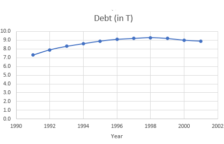
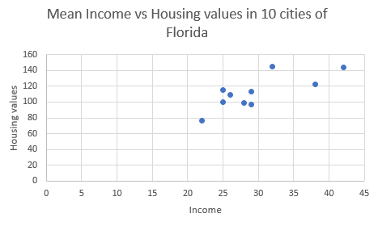

```{r setup, include=FALSE}
knitr::opts_chunk$set(echo = TRUE)
```

1.  The ages (in years) of a sample of 25 teachers are as follows:

```{=tex}
\begin{center}
\begin{tabular}{|l|l|l|l|l|}
\hline 47 & 21 & 37 & 53 & 28 \\
\hline 40 & 30 & 32 & 34 & 26 \\
\hline 34 & 24 & 24 & 35 & 45 \\
\hline 38 & 35 & 28 & 43 & 45 \\
\hline 30 & 45 & 31 & 41 & 56 \\
\hline
\end{tabular}
\end{center}
```
> a.  How many classes does Sturges' formula suggest?

> > **Answer:** Sturges' formula is : $\text{Number of classes}= 1+3.3 \log{(n)}$. $n=25$ in this case. Therefore:

$$
\text{Number of classes}= 1+3.3 \log_{10}{(25)}=5.613202 \approx 6.
$$

> b.  Develop a grouped frequency distribution, showing the frequencies, relative frequencies, percent frequencies and cumulative frequencies.

> c.  Draw a histogram and an ogive based on the frequency distribution.

> > **Answer (both b and c):**

> > We know number of classes should be 6 based on a. To find the width of each class, we want to use the following formula:

$$
\frac{\text { Largest Observation }-\text { Smallest Observation }}{\text { Number of Classes }}
$$

> > Based on the above formula, the width of each class should be $\frac{56-21}{6}=5.83333\approx 6$. Now we can construct the grouped frequency distribution as well as histogram and an ogive.


\newpage

2.  The following histogram shows the distribution of the monthly rental for a random sample of one-bedroom apartments in York, Pennsylvania.

{width="334"}

> a.  What is the total number of apartments in this sample, and what is the percentage of monthly rents that are \$750 and above? If we rank the observations from low to high, what can you say about the range of 8th ranked observation?

> > \underline{Answer:}

> > Total number of apartment in this sample is 2+5+3+8+2= 20.

> > We need to look at the last two rectangles in the histogram. They represent a rent of 750 or greater. The total frequency for these two classes would be 8+2=10. In this case, percent frequency would be $\frac{10}{20}\times 100=50\%$.

> > The 8th observation will be between 700 and 749 as the cumulative total frequency up to class of 700 to 749 is 7.

> b.  Suppose the rent for one of the apartments in the sample is \$680. How many apartments rent in the sample are going to be lower than or equal to this rent number?

> > \underline{Answer:}

> c.  Identify the shape of below histograms \footnote{Graphs are from \url{http://citadel.sjfc.edu/faculty/kgreen/MSTI130/MSTI130Text/Text_Fall_2014su28.html}}

{width="276"} {width="271"}

> > \underline{Answer:}

> > Plot on the left (histogram for years of experience) has a long tail on the right side. Hence, positively skewed.

> > Plot on the right (histogram for Daily returns for NASDAQs) has a long tail on the left side. Hence, negativity skewed.

 

3.  The U.S. National Debt over the span of a decade from 1991 to 2001 is given in the following table:

```{=tex}
\begin{center}
\begin{tabular}{|r|r|}
\hline \multicolumn{1}{|l|}{\text { Year }} & \text { Debt (in T) } \\
\hline 1991 & 7.3 \\
\hline 1992 & 7.9 \\
\hline 1993 & 8.3 \\
\hline 1994 & 8.6 \\
\hline 1995 & 8.9 \\
\hline 1996 & 9.1 \\
\hline 1997 & 9.2 \\
\hline 1998 & 9.3 \\
\hline 1999 & 9.2 \\
\hline 2000 & 9.0 \\
\hline 2001 & 8.9 \\
\hline
\end{tabular}
\end{center}
```
> a.  Is this an example of time series data or cross sectional data?

> > \underline{Answer:}

> > This is an example of time series data.

> b.  Make an appropriate plot for this data.

> > \underline{Answer:}

> 

> c.  What can you conclude from this data?

> > \underline{Answer:}

> > We can see a slight increase in debt over the first half of the decade and after that it stayed almost the same over the second half. Note that **we can't use the graph of a time series over a period of time for making conclusions about future**. This decade shows no strong trend, but in the following years the U.S. debt increased dramatically due to wars.

 

4.  The following data has mean income and housing for 10 cities in Florida. Values are in dollars (\$) and rounded to the nearest thousand.

```{=tex}
\begin{center}
\begin{tabular}{|l|l|l|}
\hline City & Income ( $\boldsymbol{x})$ & Housing (y) \\
\hline A & 26 & 109 \\
\hline B & 29 & 97 \\
\hline C & 25 & 115 \\
\hline D & 28 & 99 \\
\hline E & 38 & 122 \\
\hline F & 32 & 145 \\
\hline G & 25 & 100 \\
\hline H & 22 & 76 \\
\hline I & 29 & 113 \\
\hline J & 42 & 144 \\
\hline
\end{tabular}
\end{center}
```
> a.  What would be an appropriate diagram representing the relationship between Income $(\mathrm{x})$ and Housing $(y)$?

> > \underline{Answer:}

> > Scatterplot.

> b.  Without looking at the graph or calculating a statistic, how would you describe the relationship between the income $(\mathrm{x})$ and housing $(y)$? Now make the graph and validate what you were expecting from the graph.

> > \underline{Answer:}

> > Generally, as income increases, people will have a bigger budget for their spending. So the relationship should be positive.

> > 
